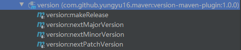

# version-maven-plugin
这是一个用于对Maven聚合继承项目的版本号进行便捷变更的工具。

在微服务架构中使用RPC框架，为了让服务消费者实现像调用本地方法一样透明的通过网络进行RPC，服务提供者一般会提供facade jar用于服务消费者集成并通过动态代理生成本地调用stub。随着业务进展，facade jar需要频繁升级版本号。

该plugin相对[mojohaus的versions-maven-plugin](https://github.com/mojohaus/versions-maven-plugin)提供了更简单易用的指令用于递增的变更Maven聚合继承项目的版本号。

## 要求
- Maven3
- Java8

## 约定
项目版本号格式为 `x.y.z`或`x.y.z-SNAPSHOT`，`xyz`为有效的正整数

## 集成
```xml
<plugin>
    <groupId>com.github.yungyu16.maven</groupId>
    <artifactId>version-maven-plugin</artifactId>
    <version>1.0.0</version>
</plugin>
```
一般的Maven大型聚合项目中，版本号在父模块中定义，所有子模块使用从父模块继承的版本号。

建议将版本插件添加到顶层父模块中，执行指令时会递归的修改所有子模块版本号。
## goal(插件命令)


- `makeRelease`  将快照版本变为正式版本 `x.y.z-SNAPSHOT -> x.y.z`
- `nextMajorVersion`  变更为下一个主版本 `x.y.z -> （x+1).0.0-SNAPSHOT`
- `nextMinorVersion`  变更为下一个次版本 `x.y.z -> x.(y+1).0-SNAPSHOT`
- `nextPatchVersion`  变更为下一个补丁版本 `x.y.z -> x.y.(z+1)-SNAPSHOT`
